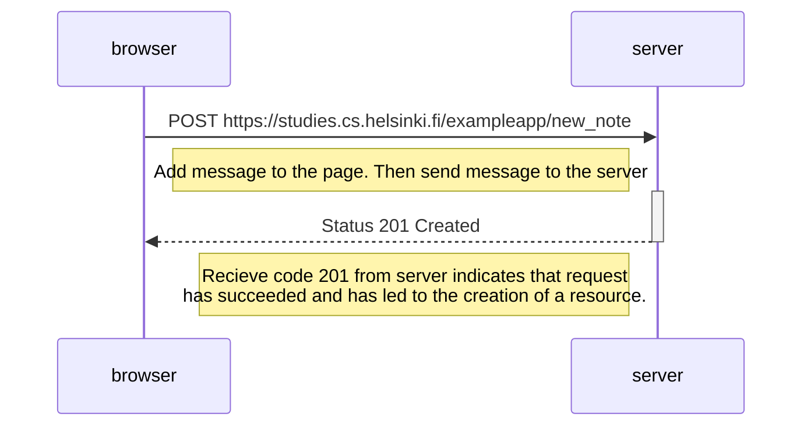

```mermaid
sequenceDiagram
    participant browser
    participant server

    
    browser->>server: POST https://studies.cs.helsinki.fi/exampleapp/new_note
    Note right of browser: Add message to the page. Then send message to the server 
    activate server
    server-->>browser: Status 201 Created
    deactivate server
    
    Note left of server: Recieve code 201 from server indicates that request <br> has succeeded and has led to the creation of a resource.
```
